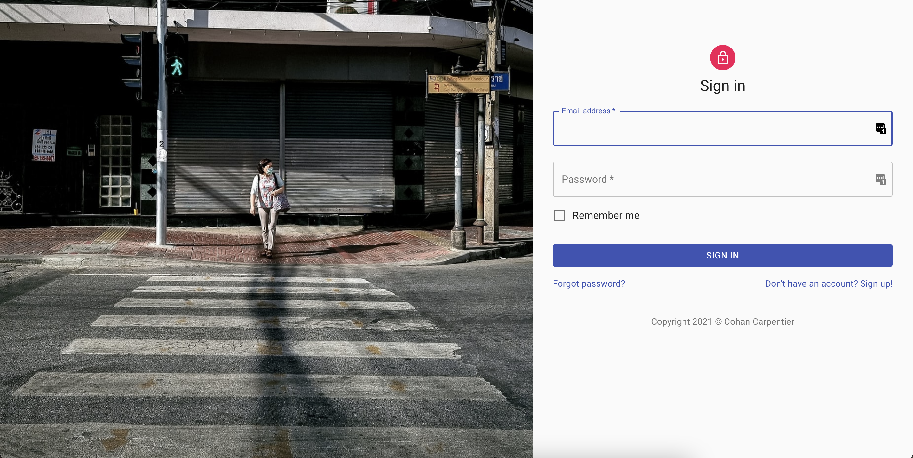

# 🎓 Coding challenge

This application is built using CRA and TypeScript.

See it live:
https://nesto-coding-challenge.netlify.app

(Note: refreshing on Netlify can crash the application if you're not on the root)

## What is this?



This application aims to:
- Greet you with a login page
- Show you the most recent posts
- Show you your albums

## Getting started

```bash
npm i
```
```bash
npm start
```

You can then open your browser at https://localhost:3000/

## Potential improvements

- Localization (i18n)
- Login form validation (probably with react-hook-form)
- Support pagination
- Integrate some sort of global state (although probably no needed with current requirements)
- Query params for filters
- Lazy-loading or some other sort of virtualization for better list performance
- E2E tests
- Improve mobile UX & responsivity
- More unit tests

_Time spent: around 2 hours_
